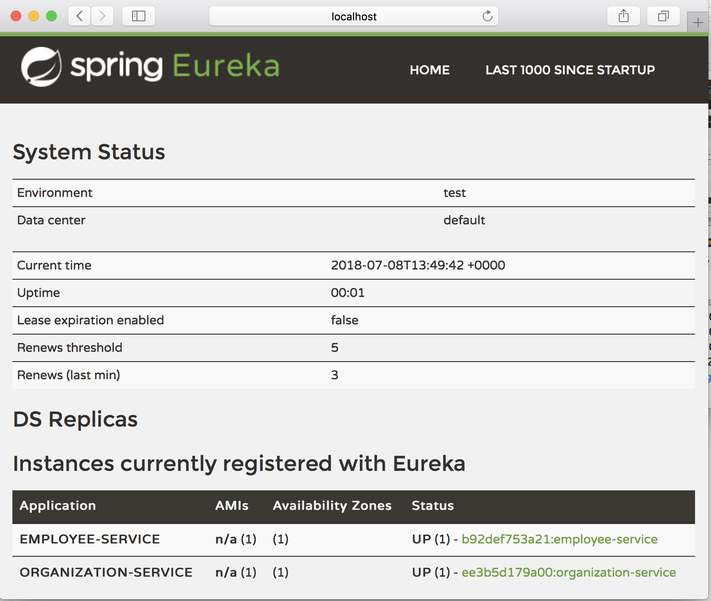
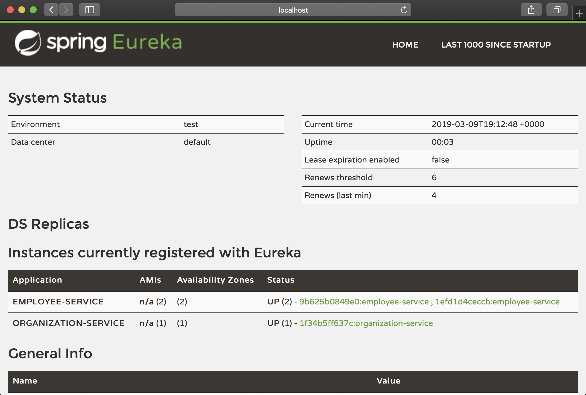

# microservice-docker

We're use Java 11 and Spring Boot 2.1.3.RELEASE version.

We have 4 modules. 2 of these modules for infrastructure such as config and discovery server.

Each module has its own Dockerfile and env. files. Env. files contains an ip, port and other settings. We will pass these to spring boot app.

## Before start
We are separated CI and CD pipeline. Therefore, spring boot jar should be available in your classpath.

Go to root path and run **mvn clean install** to create all artifacts.

After creating jars you can create docker image from jar file. Go to each module directory and create docker image.

Our Dockerfile is very simple for create image. For example;

```
FROM openjdk:11-jre-slim-sid

WORKDIR /home/app
COPY target/config-server-0.0.1-SNAPSHOT.jar config-server.jar

CMD java -jar config-server.jar
```

And we can create image such as below;

```
cd config-server
docker build -t config-server:v1 .
```  

We are created image for each module. Run **docker images** and output look like below;

```
REPOSITORY                                TAG                 IMAGE ID            CREATED             SIZE
employee-service                          v1                  66261584eaec        30 minutes ago      149MB
organization-service                      v1                  a5be7f277dca        33 minutes ago      150MB
discovery-server                          v1                  b35fdd15cada        About an hour ago   146MB
config-server                             v1                  f39259fbe80f        2 hours ago         128MB
```

Alternatively you can create all images in the sub directory which has a Dockerfile via dockerize.sh script. Script expects the version info for input.

We can explain our microservice architecture as follows;

* We have a config server for serving application config for other app. Running with native profiles for serving config in classpath. 
* We have a discovery server for all service can communicate to other. Running with default profile.
* We have an employee and organization service. These service pull own configuration from config server and serving own business logic.
* Organization service using employee service with feign client over the discovery service.

Our sample docker-compose file such as below;

```
version: '3.3'

services:
  config-server:
    image: config-server:v1
    env_file:
      - config-server/env/native.env
    ports:
      - '8088:8080'

  discovery-server:
    image: discovery-server:v1
    env_file:
      - discovery-server/env/local.env
    ports:
      - '8090:8080'
    depends_on:
      - config-server

  employee-service:
    image: employee-service:v1
    env_file:
      - employee-service/env/local.env
    ports:
      - '8092:8080'
    depends_on:
      - discovery-server
      - config-server
    restart: on-failure

  organization-service:
    image: organization-service:v1
    env_file:
      - organization-service/env/local.env
    ports:
      - '8094:8080'
    depends_on:
      - config-server
      - discovery-server
      - employee-service
    restart: on-failure
```

* Each service expose 8080 port in container. And we will map different ports on host.
* Discovery server depends on config server.
* Employee service depends on config server and discovery server.
* Organization service depends on config server, discovery server and employee service.

We can also build images via following command;
```bash
docker-compose -f docker-compose-local.yml build
```

Let's beam up;
```
docker-compose -f docker-compose-local.yml up -d
```

After all services up and register to discovery server, you can go to **http://localhost:8094/organization/1/employee**

Output looks like this -> 
```
[
    "1:Alican",
    "1:Onur",
    "1:Lemi",
    "1:Burak"
]
```

When you go to eureka dashboard you can see 2 services are registered to discovery server;


Also, you can scale up the employee service to 2 instances. After scaling up, you could see in two instances of employee service registered to eureka discovery server in dashboard.
Feign client could pick up one of these for retrieve employee list.  

> You can scale up to 2 instances like this: docker-compose -f docker-compose-local.yml scale employee-service=2
> Please note that, you should change host port mapping when scaling up.

These service can communicate with service name instead of ip/port.

After all you can stop all of them;
```
docker-compose -f docker-compose-local.yml down -v
```

And also you can remove images;
```
docker-compose -f docker-compose-local.yml down -v --rmi all
```